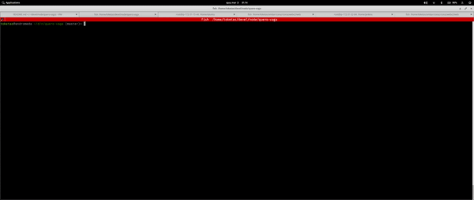

# Teste técnico Cloud Engineer Quero Educação

## Stack utilizada
Backend - Node.js
Frontend - Next.js (SSR)
Database - PostgreSQL

## Requisitos para construção

Docker 19.03.6+
Docker-Compose 1.24.0+

## Instruções para subir localmente

No diretório raiz do projeto
    ./run_stack.sh

