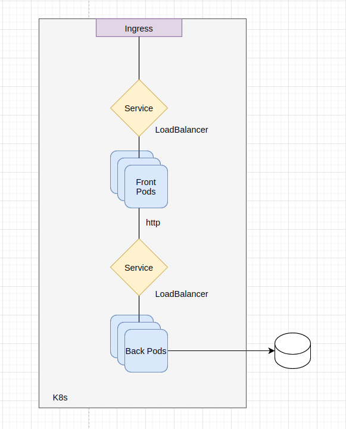

# Teste técnico Cloud Engineer Quero Educação

## Nível 1
### Stack utilizada
Backend - Node.js
Frontend - Next.js (SSR)
Database - PostgreSQL

### Requisitos para construção

Docker 19.03.6+
Docker-Compose 1.24.0+

### Instruções para subir localmente

No diretório raiz do projeto
    ./run_stack.sh


## Nível 2

### 2.1 Arquitetura de alta disponibilidade proposta:



Esta arquitetura representa uma arquitetura de microserviços dentro de um
orquestrador Kubernetes. Cada elemento colorido representa uma entidade no K8s.
Temos então de cima para baixo:

- **Ingress**: ponto de entrada para o orquestrador Kubernetes, gerenciado por um
Ingress Controller (nginx, traefik, HAProxy)
- **Services**: tanto para aplicação de frontend quanto backend, pois queremos
gerenciar a Alta Disponibilidade dessas aplicações.
- **Pods**: as entidades do K8s responsáveis por rodar nossas aplicações,
    gerenciados por Deployments

Utilizando esta tecnologia, temos uma forma de oferecer o serviço com Alta
Disponibilidade mantendo a infraestrutura estuturada e simples. Com um serviço de provisionamento,
podemos configurar os Workers e Pods do K8s para garantir que há pelo menos uma
aplicação em cada região do Data Center, garantindo ainda mais a Alta
Disponibilidade. Por fim temos a possibilidade de escalar o cluster K8s para
não depender apenas de um Nó mestre, mas sim vários, dependendo do uso.

### 2.2 Plano de Elasticidade

Com esta solução é possivel configurar e automatizar a escalabilidade
horizontal da aplicação por meio de uma entidade chamada Auto-Scale. Esta
entidade pode ser utilizada tanto em um contexto de Pods de uma aplicação
quanto para nós dentro do cluster K8s. Um exemplo de configuração:

```
apiVersion: autoscaling/v1
kind: HorizontalPodAutoscaler
metadata:
  name: {{ app_name }}
  namespace: {{ namespaces[env] }}
spec:
  maxReplicas: {{ max_replica[env] }}
  minReplicas: {{ min_replica[env] }}
  scaleTargetRef:
    apiVersion: apps/v1
    kind: Deployment
    name: {{ app_name }}
  targetCPUUtilizationPercentage: 50
```

No caso, o auto-scale está baseado no uso de CPU dos Pods de um determinado
Deployment. Caso o uso de CPU estiver acima do valor target, será feito o
scale-up da aplicação, limitado ao valor maxReplicas. Desta forma temos a
aplicação on-demand juntamente com casos de pico de utilização, e para otimizar
os custos, o Auto-scale faz o scale-down da aplicação sempre que possível.
Outra forma de otimizar custos é dependendo da regra de negócios, configurar um
scale-down da aplicação em certos horários.

### 2.3 CI/CD


Para esta aplicação utilizaria as seguintes ferramentas para um pipeline
Continuous Integration Continuous Delivery:

- **Code**: poderia ser qualquer uma das três Github, Bitbucket, GitLab contanto
que tenha suporte a WebHooks para a próxima etapa (exemplo Webhook no [Bitbucket](https://medium.com/@nishizuka23/build-jenkins-pipelines-via-bitbucket-hooks-f92435e55f55))

- **Build & Test**: A escolha foi o Jenkins, pela flexibilidade e suporte a vários
plugins. Uma pipeline poderia ser escrita desta forma:

```
pipeline {
    agent any
    options {
        timeout(time: 15, unit: 'MINUTES')
    }
    environment {
        APP_NAME = 'app_name'
    }
    stages {
        stage ('Preparation') {
            steps {
                script {
                    buildName "$APP_NAME-$BRANCH_NAME-$BUILD_NUMEBER"
                    git(
                        url: "repo_url"
                        credentialsId: "repo_credentials"
                        branch: "$BRANCH_NAME"
                    )
                }
            }
        }
        stage ('Build') {
            steps {
                script {
                    echo 'Building...'
                    dockerImage = docker.build("$DOCKER_REGISTRY:$DOCKER_TAG", "-f path/to/dockerfile .")
                }
            }
        }
        stage ('Test') {
            when {
                expression { params.SKIP_TESTS != 'TRUE' }
            }
            steps {
                script {
                    echo 'Testing...'
                    dockerImage.inside('-v /tmp:/tmp') {
                        // Run tests here
                    }

                    // Sonar Code Analysis
                    def scannerHome = tool 'SonarQubeScanner'
                    withSonarQubeEnv('SonarQube') {
                        sh """
                            ${scannerHome}/bin/sonar-scanner \
                            -Dsonar.projectKey=${BRANCH_NAME}
                        """
                    }
                    timeout(time: 5, unit: 'MINUTES') {
                        waitForQualityGate abortPipeline: true
                    }
                }
            }
        }
        stage ('Push Image') {
            steps {
                script {
                    docker.withRegistry(REGISTRY_URL, REGISTRY_CREDENTIAL) {
                        dockerImage.push()
                    }
                }
            }
        }
    }
    post {
        failure {
            // Send e-mail
        }
    }
}
```

- **Deploy**: Script Ansible-Playbook com Openshift provisionando Deployments no
Kubernetes. Template jinja2 para criar dinamicamente os documentos de
provisionamento.

```
    .
    ├── tasks
    │   └── main.yaml
    ├── templates
    │   ├── autoscale.yaml.j2
    │   ├── configmap.yaml.j2
    │   ├── cronjobs.yaml.j2
    │   ├── deployment.yaml.j2
    │   ├── ingress.yaml.j2
    │   ├── namespace.yaml.j2
    │   └── service.yaml.j2
    └── vars
        ├── dev_env_vars.json
        ├── main.yaml
        ├── prod_env_vars.json
        └── qa_env_vars.json
```

- **Operador e Monitoramento**: Utilização de ferramentas populares no K8s como
Kibana, Prometheus e visualização geral com Grafana. Fluentd como agregador de
logs. Todos eles dentro de um Cluster k8s gerenciado via Kubernetes-Dashboard.

